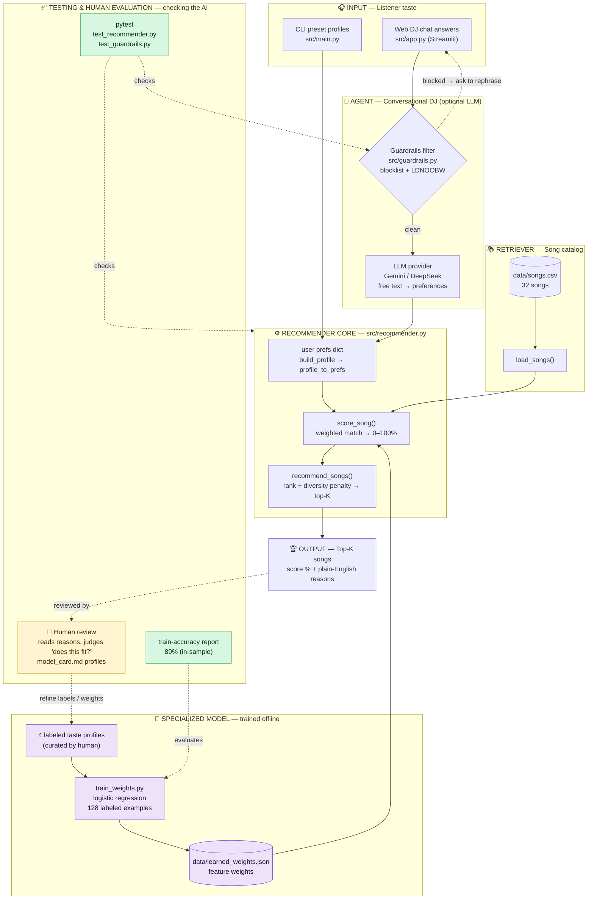

# 🎵 MuxiReco — System Architecture

A component-level view of how the recommender is organized: the main parts, how
data flows **input → process → output**, and where **humans and automated tests**
check the AI's results. (For the detailed scoring math, see
[sketch design.mmd](sketch%20design.mmd).)

## Legend — mapping to system components

| Rubric component | In this project | Files |
|------------------|-----------------|-------|
| **Retriever** | Loads the song catalog that supplies recommendation candidates | `data/songs.csv`, `load_songs()` |
| **Agent** | The conversational DJ that gathers taste and (optionally) uses an LLM to read free-text answers | `src/app.py`, optional Gemini/DeepSeek |
| **Specialized / fine-tuned model** | A trained logistic-regression model that *learns* the scoring weights from labeled data | `src/train_weights.py` → `data/learned_weights.json` |
| **Recommender core** | Scores every song against the listener and ranks the top-K with reasons | `src/recommender.py` (`score_song`, `recommend_songs`) |
| **Evaluator** | Reports the trained model's accuracy; human reads the reasons to judge fit | train-accuracy print + `model_card.md` |
| **Tester** | Automated tests over the real code paths | `tests/test_recommender.py`, `tests/test_guardrails.py` |

## Where humans / testing check the AI (the dashed arrows)

- **`pytest` → core & guardrails** — automated tests verify scoring, ranking, the diversity penalty, and that unsafe input is blocked.
- **Accuracy report → trained model** — the trainer prints in-sample accuracy (89%) so the learned weights can be sanity-checked.
- **Output → human review** — a person reads each recommendation's plain-English reasons and judges whether it actually fits the listener (documented in the model card).
- **Human → training labels** — that human judgment feeds back into the curated taste profiles the model trains on, closing the loop.

## Data flow in one line

`taste input → (guardrails + LLM) → prefs → score against catalog using learned weights → rank → top-K with reasons → checked by tests + human`
